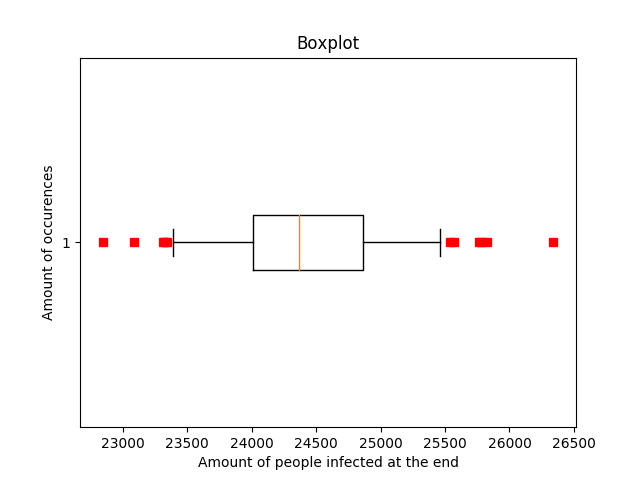
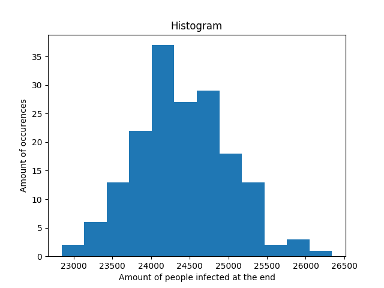
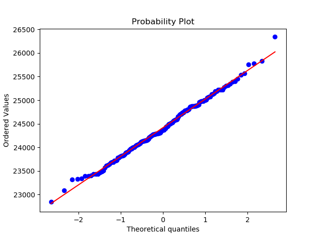
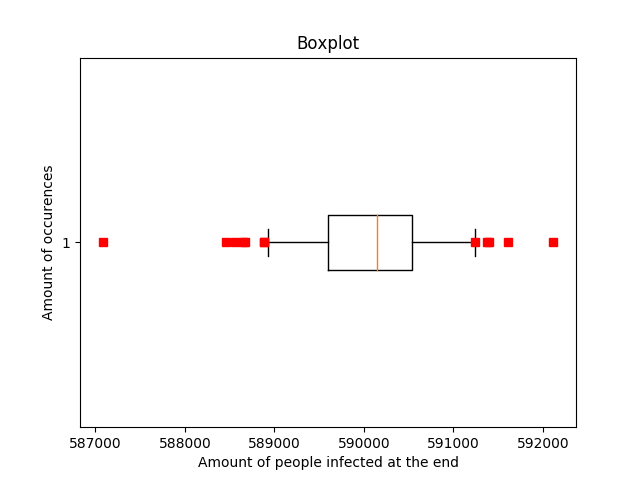
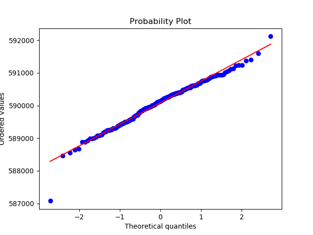

# Method
We searched for good bounds for the tests. We did this by running the tests multiple times with different seeds. We then analyse the amount of infected people at the end. We will use this data to extrapolate good bounds for the tests.

# Gevonden waarden
## seedingRate
 - n = 173
 - mean = 24417.4855491
 - standard deviation = 599.440833924
 - results = \[25002, 23969, 23832, 24004, 23087, 23827, 25387, 23673, 23610, 24775, 24564, 23433, 23787, 23937, 23988, 23686, 23901, 24441, 25781, 23884, 24293, 24983, 23998, 24692, 25067, 24707, 25131, 23730, 24344, 26341, 24494, 24145, 24875, 24812, 24146, 25192, 24799, 23811, 24448, 24649, 24961, 25306, 24089, 24179, 24452, 24076, 24979, 24051, 24287, 24870, 25352, 24803, 25569, 23723, 24110, 23574, 25012, 23721, 25224, 24776, 23471, 24040, 24294, 25185, 24209, 24565, 24298, 25077, 24360, 24517, 24060, 24577, 24862, 23315, 23326, 25315, 23780, 24031, 24367, 23513, 24527, 24132, 24594, 23627, 24403, 24879, 24372, 23823, 24273, 24651, 24375, 24969, 24612, 23857, 25826, 24287, 23440, 23799, 24882, 23389, 24512, 25761, 24142, 23691, 25131, 25058, 24705, 24146, 24067, 24754, 25273, 24898, 22843, 24859, 25216, 25457, 24885, 23398, 24875, 25146, 24246, 24482, 24157, 23406, 24690, 23438, 24777, 24522, 24225, 24743, 24143, 23958, 24295, 24870, 24235, 24742, 25221, 24277, 24126, 24179, 25535, 24910, 24727, 24280, 23911, 24303, 23490, 24775, 24012, 24850, 24258, 24979, 24593, 25003, 24311, 23893, 24319, 24116, 24267, 24286, 24142, 23974, 23346, 23649, 24429, 24495, 25396, 24585, 24370, 24406, 24554, 25223, 25071\]

We can conclude that the data of this test is rather normally distributed. We can see this in the QQ-plot above.

## immunityRate
 - n = 100
 - mean = 5
 - std dev = 0
As the standard deviation is zero, the plots are not usefull here.

## measles
 - n = 210
 - mean = 590085.8428571429
 - std dev = 660.8227044636814
 - results = \[589099, 589827, 590222, 589587, 589876, 589258, 589788, 590521, 589706, 590845, 589493, 588884, 589427, 589357, 590802, 589521, 588462, 589893, 590515, 589968, 590389, 590248, 589314, 589536, 590317, 590196, 590688, 589428, 590628, 591380, 590135, 589944, 590342, 590746, 589702, 590633, 590110, 590548, 590011, 590272, 589925, 591040, 590114, 591246, 589692, 590668, 590339, 590143, 590511, 590234, 590912, 588997, 591009, 590016, 589926, 589724, 589664, 590360, 590766, 590549, 589469, 590185, 589304, 591606, 589252, 590372, 589502, 590908, 591226, 589399, 590555, 590149, 590946, 589890, 589649, 590008, 590170, 589843, 589584, 588925, 589584, 590953, 590291, 590087, 589766, 590608, 590420, 589437, 589975, 590260, 590589, 590366, 590533, 590400, 590886, 590431, 589250, 590050, 590260, 589298, 590256, 590617, 590079, 589205, 590837, 590481, 589377, 589204, 589828, 590482, 592118, 590631, 589110, 589949, 591403, 590604, 589459, 589506, 590891, 591128, 589777, 590119, 590263, 587079, 590794, 590758, 589081, 590159, 590054, 590127, 589576, 589880, 589913, 590214, 590398, 590364, 590709, 590379, 589798, 589564, 591080, 590171, 590227, 590262, 590139, 588990, 588559, 589083, 589280, 590945, 589847, 590772, 589957, 589890, 591122, 590406, 590549, 590345, 589535, 590073, 589561, 590596, 589460, 590387, 590917, 589919, 590022, 590779, 589306, 589501, 591241, 590022, 589955, 590345, 589921, 589248, 588672, 589001, 589169, 590396, 589676, 590603, 590114, 589584, 590941, 590427, 590681, 589994, 590612, 590470, 589941, 589257, 590881, 590315, 590366, 590012, 590224, 588878, 589030, 588645, 589376, 590762, 589699, 590493, 590417, 590314, 590946, 590544, 590483, 590682\]

We can conclude that the data of this test is rather normally distributed. We can see this in the QQ-plot above.

## maximum
 - n = 100
 - mean = 600 000
 - std dev = 0
As the standard deviation is zero, the plots are not usefull here.

## Source code
 - [Data Gathering](assets/src/week2/mean.py)
 - [Plotting](assets/src/week2/plot.py)
