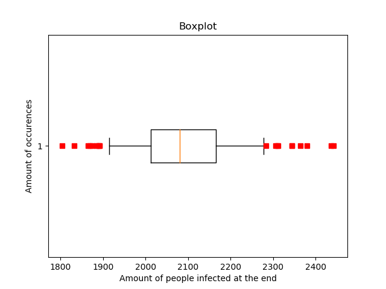
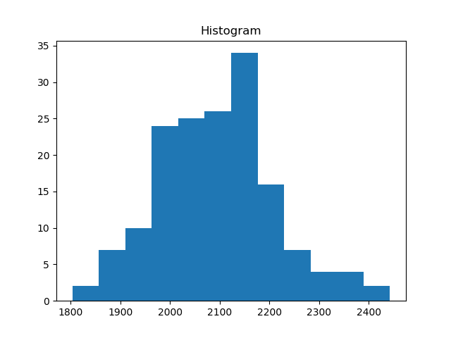
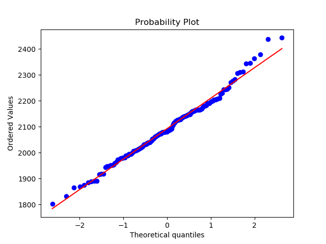
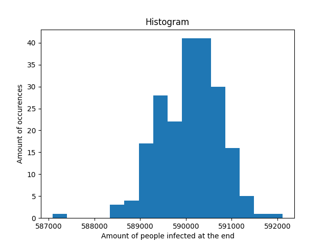

# Assignment
> Establish reasonable ‘bounds’ for the output of the simulator.

More precisely: we have to find bounds for the different [test cases of the BatchRuns](https://github.com/broeckho/stride/blob/deb54e1e7be43e104aa404f83329640229f7c894/test/cpp/gtester/BatchRuns.cpp#L45-L49) test.
Reasonable bounds are bounds for which the tests don't fail due to the randomness of the simulation, but do fail when a significant difference in output is made by the simulator.
The suggested methods is to run the simulation a few times and then take a range of 10% around the mean as bounds.

# Used method
As suggested we started by running the tests multiple times with different seeds by using a Python script.
By analysing the amount of infected people at the end, we can extract reasonable bounds for the tests.
The analysis were done using QQ-Plots, Histograms and boxplots.

The changes to the `BatchRuns` test were made in commit [17d64e173f41d6048fb3320edae4fce5d345a874](https://github.com/LEDfan/Bachelorproef/commit/17d64e173f41d6048fb3320edae4fce5d345a874).

# Results
## Influenza A
 - n = 161
 - mean = 2092.552795031056
 - standard deviation = 116.60326645015648
 - results: [data points](assets/src/week2/influenza_a_data.txt)

The QQ-plot clearly indicates that the data is rather normally distributed.
Therefore the bounds can be determined by using 2 times the standard deviation.
In the boxplot we can however see that there are quite a few outliers. 
If such outliers occur in actual tests, this might result in false negatives.
In the test results we can see that for example the outliers 1803 and 2443 do not fall in the range [1859.34, 2325.76].
When we compare this interval to [1883.30,2301.81] obtained by using the 10% from the assignment, 
we see that our chosen interval is a bit less strict, but adjusts better for the actual observed variability in the data.

## Influenza B
 - n = 100
 - mean = 0
 - standard deviation = 0

In this test nobody ever gets infected since the `seeding_rate` is set to 0.
Therefore the standard deviation is also 0, which makes plots for this run not very useful.
The bounds for this test are fixed at 0.

## Influenza C
 - n = 100
 - mean = 5
 - standard deviation = 0

This test always gave as result 5 thus the standard deviation is 0.
Plots for this run aren't very informative.
The low result is expected since the immunity rate is very high. 
The bounds for this test are fixed at 5.

## Measles 16
 - n = 210
 - mean = 590085.8428571429
 - standard deviation = 660.8227044636814
 - results: [data points](assets/src/week2/measles_data.txt)

Just like in the Seeding Rate test it can be concluded that the data is rather normally distributed by looking at the QQ-Plot.
Again the bounds are set to 2 times the standard deviation.
Unfortunately we also notice an outlier in the data of this test that would be rejected by the chosen interval.
We find the interval [588764.19, 591407] which is stricter than [531077.258, 649094.427] obtained by using the 10%.

## Measles 60
 - n = 100
 - mean = 600 000
 - standard deviation = 0

In this test the whole population is infected. Since the $R_0$ parameter is at the highest possible level this is expected.
The bounds for this test are fixed at 600 000.

## Source code
 - [Data Gathering](assets/src/week2/mean.py)
 - [Plotting](assets/src/week2/plot.py)
