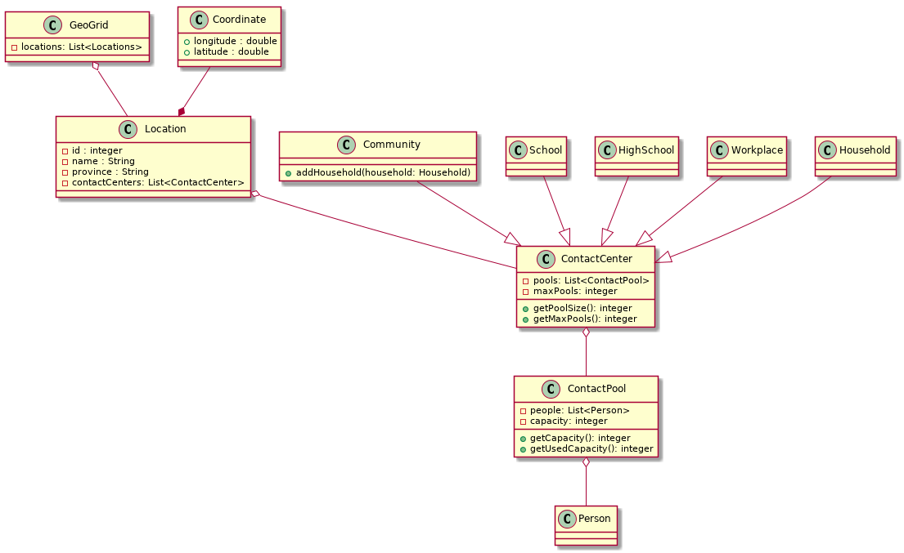

This design documentation was an initial design before starting the implementation and is no longer up to date. Please see <a href="/doxygen/">the doxygen documentation</a> instead for accurate documentation and diagrams.

The UML-diagram of the current design for the `GeoGrid Generator` and `Pop Generator` can be found below (click to enlarge):

