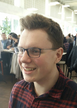
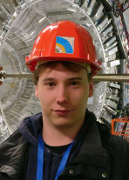
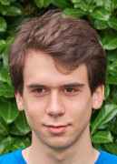

# Het team

 |  |  | 
Niels Aerens ([@PurgingPanda](https://github.com/PurgingPanda)) | Thomas Avé ([@thomasave](http://github.com/thomasave)) | Tobia De Koninck ([@LEDfan](https://github.com/LEDfan)) | Robin Jadoul ([@RobinJadoul](https://github.com/RobinJadoul))
{:.noborder}

# Contactpersoon
Tobia De Koninck
([tobia.dekoninck@student.uantwerpen.be](mailto:tobia.dekoninck@student.uantwerpen.be))

# Status

| CodeFactor | Travis | Clang 5 |GCC 6 | GCC 7 |
| :--: | :--: | :--: | :--: | :--: |
|  |  |  |  |  |

# Assignments

- [Introductory exercise](introduction)
- [Bounds research](bounds)
- [Follow-up Bounds research](follow-up)

# Links

- [Travis](https://travis-ci.com/LEDfan/Bachelorproef)
- [GitHub](https://github.com/LEDfan/Bachelorproef)
