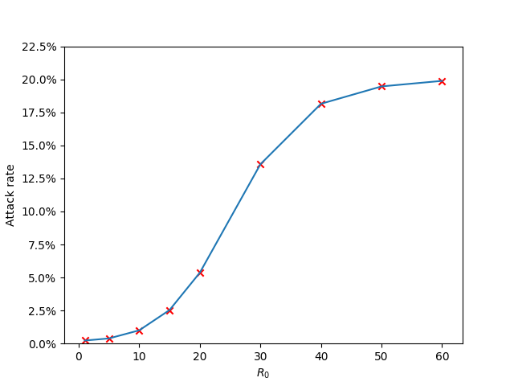

# Introductory exercise

As was rather to be expected, with an increasing $R_0$, we get an increasing attack rate.

- [The source code for our experiments](assets/src/introduction.py)
- [The source code for the plot](assets/src/introduction-plot.py)
