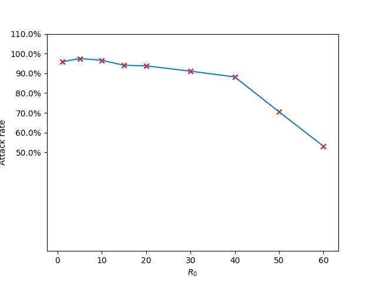

# Introductory exercise

As was rather to be expected, with an increasing $R_0$, we get an increasing attack rate.
This experiment was done with commit [9ed4f66da8b459fdd45b9d786270824967dfe98a](https://github.com/broeckho/stride/commit/9ed4f66da8b459fdd45b9d786270824967dfe98a), using the python bindings.

The following experiment was executed with the latest commit using the compiled binary. It could not be done using the python bindings as these are broken in the latest commit.

We were surprised by the second result, because it is against our intuition. It is unexpected that any disease will infect (almost) 100% of the population, especially with a R0 of 1. Furthermore when R0 increases, there are less people infected at the end.

We initially expected that the outcome between two versions would be consistent. Because of such a big difference in we suspect a bug was introduced.

- [The source code for our first experiments](assets/src/introduction.py)
- [The source code for the first plot](assets/src/introduction-plot.py)
- [The source code for the second plot](assets/src/introduction-plot-new.py)
