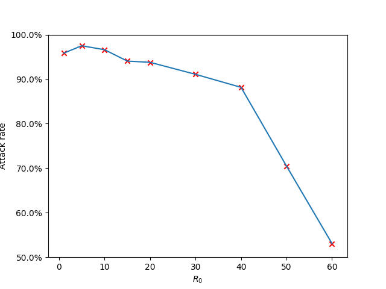

# Introductory exercise

As was rather to be expected, with an increasing $R_0$, we get an increasing attack rate.
This experiment was done with commit (9ed4f66da8b459fdd45b9d786270824967dfe98a), using the python bindings.

The following experiment was executed with the latest commit using the compiled binary. It could not be done using the python bindings as these are broken in the latest commit.

- [The source code for our first experiments](assets/src/introduction.py)
- [The source code for the first plot](assets/src/introduction-plot.py)
- [The source code for the second plot](assets/src/introduction-plot-new.py)
